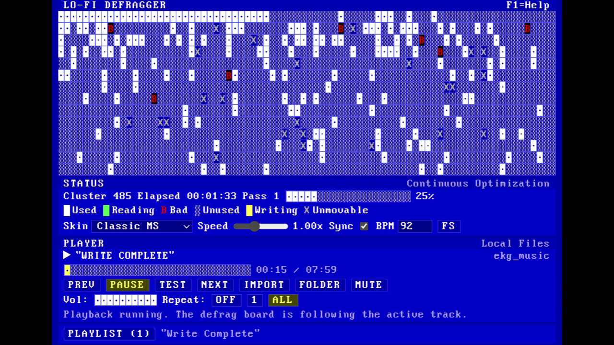
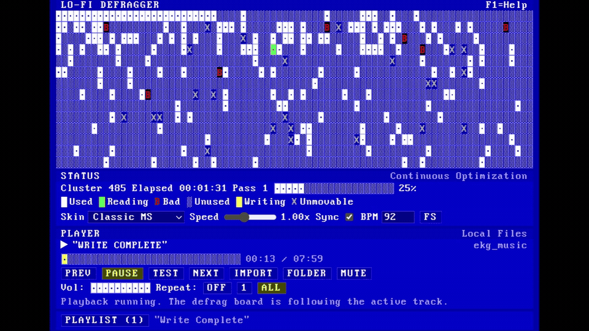

  

# Lo-fi Defragger

  <strong>A slow, strange, deeply unnecessary local music player disguised as a 1990s disk utility.</strong> 
  Bring your own music. Watch the blocks move. Let the machine do its little ritual.

  <a href="#windows-start-here">Windows start</a> &bull; <a href="#build-a-windows-installer">Build an installer</a> &bull; <a href="#the-good-stuff">What it does</a>

## In Motion

The repository page shows a looping preview made from the real app demo. The source-quality 31-second `Lo-Fi Defrag.mp4` is included in the repository too, with its audio intact.

## Windows: Start Here

You do not need to type commands to try the app.

1. Install [Node.js 22 LTS](https://nodejs.org/).
2. On this GitHub page, choose **Code** then **Download ZIP**. Extract it somewhere normal, such as your Desktop or Documents folder.
3. Double-click **`Run Lo-fi Defragger.bat`**.

The first launch downloads the app's dependencies. Every later launch simply opens the app. When it appears, open **Playlist**, then choose **Import** for songs or **Folder** for a music directory.

> There is not a signed installer release yet. The double-click launcher is the easiest current path from a fresh ZIP to a running app.

## Build a Windows Installer

Want a proper `.exe` installer for your own machine? Double-click **`Build Lo-fi Defragger Installer.bat`**. It installs the locked dependencies, builds the Windows package, then opens the folder containing the result.

The installer lands in `out\make\squirrel.windows\x64`. The original `build-windows.bat` remains available for anyone who prefers the plain build script.

You can also create the same Windows artifact without installing anything locally: on GitHub, open **Actions**, choose **Build Windows EXE**, press **Run workflow**, then download the artifact when it completes.

## The Good Stuff

| | |
| --- | --- |
| **Your local library** | Add individual tracks or a folder. The app reads only what you select and does not modify source audio files. |
| **A real player underneath** | Play, pause, seek, reorder, repeat, mute, and preserve your playlist between launches. Missing tracks are marked instead of crashing the app. |
| **A visualizer with a job** | The board reacts to playback and estimated tempo, or you can set the simulation speed yourself. `Test` starts the visualizer without music. |
| **Two good kinds of old** | Switch between Classic MS and CRT Lounge. The Studio Modern skin has been respectfully retired. |

The picker accepts `.aac`, `.aif`, `.aiff`, `.flac`, `.m4a`, `.mp3`, `.mp4`, `.ogg`, `.opus`, `.wav`, and `.webm`. Electron's bundled Chromium performs playback, so unusual codecs can still vary by file encoding.

## For Tinkerers

The friendly Windows scripts are the recommended route. The project also has the usual developer commands when you want them:

| What you need | Command |
| --- | --- |
| Start development mode | `npm run dev` |
| Run the test suite | `npm run test` |
| Type-check | `npm run typecheck` |
| Lint | `npm run lint` |
| Package this platform | `npm run build` |
| Make Windows, Linux, or macOS packages | `npm run make:win`, `npm run make:linux`, `npm run make:mac` |

Platform-specific packages must be built on their matching operating system. The full packaging and GitHub Actions guide lives in [DISTRIBUTION.md](DISTRIBUTION.md).

## Soundtrack Status

The curated Lo-fi Defragger soundtrack is still being assembled, so no music files ship in this repository yet. Bring your own local tracks for now. [TRACKLIST.md](TRACKLIST.md) explains the contribution policy and how music will be handled safely.

## Project Docs

- [Technical guide](TECHNICAL.md): architecture, local data handling, and the test surface.
- [Distribution guide](DISTRIBUTION.md): Windows-first running, installer output, and release workflow.
- [Soundtrack notes](TRACKLIST.md): current music status and contribution guidance.
- [MIT License](LICENSE)

## Contributing

Fork the repository, make a focused change, run `npm run typecheck`, `npm run lint`, and `npm run test`, then open a pull request. Please do not commit private music libraries, personal playlists, generated installers, or `out/` build artifacts.
